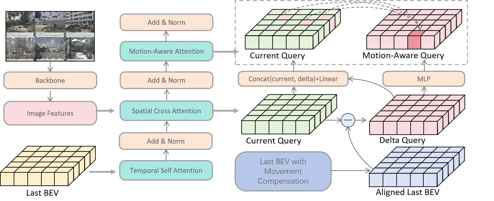

# MABEV: Motion-Aware BEVFormer
**"Enhancing BEVFormer with Motion-Aware Query Fusion"**

Bird’s Eye View (BEV) perception has become a cornerstone technique in autonomous driving, enabling spatially consistent scene understanding from multi-view cameras. BEVFormer is a representative approach that leverages transformer-based temporal and spatial attention to project multi-view image features into the BEV space. While it performs well in static environments, its effectiveness in dynamic scenes remains limited due to several factors:

- The temporal attention mechanism does not explicitly model the motion discrepancy across frames;
- The fusion between current and previous BEV queries is structure-agnostic, which leads to underutilization of temporal motion cues;
- Static and dynamic objects are modeled uniformly, lacking targeted motion-aware refinement.

To address these limitations, we propose MABEV (Motion-Aware BEVFormer) — a lightweight yet effective enhancement to BEVFormer. MABEV introduces an explicit delta query mechanism to capture the motion-induced differences between temporally aligned BEV queries to generate motion-aware queries for downstream attention.

## Highlights
-  Motion-aware delta query module to enhance dynamic object perception
-  Improved mAP on NuScenes
-  Compatible with BEVFormer and MMDetection3D framework

##  Overview
 Overview of MABEV Encoder with Motion-Aware Query Fusion

Our proposed MABEV enhances the BEVFormer encoder by introducing a motion-aware delta attention module. Given multi-view image features and a historical BEV query, we first apply temporal self-attention to align the past BEV features with the current frame. The aligned previous BEV query is then compared to the current BEV query to compute a delta query, representing motion-induced differences. This delta query is fused with the current query via an MLP-based fusion module to generate a motion-aware query, which is subsequently refined through motion-aware attention. This three-stage attention pipeline — temporal → spatial → motion-aware — effectively improves the perception of dynamic objects while maintaining compatibility with the original BEVFormer framework.

##  Experiment

-  Configuration
  Base Model: bevformer_tiny.py (with motion-aware delta attention)

  Dataset: NuScenes Full (trainval split)

  Load from the pretrained model: BEVFormer-tiny
  
  Samples per GPU: 4

  Total Batch Size: 4 

  Optimizer: AdamW, lr = 1.5e-4

  Scheduler: StepLR with warmup

  Training Epochs: 24

-  Hardware

  GPU: NVIDIA RTX 3090 (24GB)

-  Performance on NuScenes Full
  
| Method | Pretrain | Backbone | Lr Schd	| NDS	| mAP	| Config | Download |
| :---: | :---: | :---: | :---: | :---: | :---: | :---: | :---: |
| MABEV-tiny (Ours)|Tiny|R50|24ep|38.99|27.53|[ma_bevformer_tiny.py](projects\configs\bevformer\ma_bevformer_tiny.py)|[model]/[log]|
| Pretraned BEVFormer-tiny|/|R50|/|35.4|25.2|/|[model]/[log]|
| BEVFormer-tiny|Tiny|R50|24ep|Coming soon|Coming soon|[bevformer_tiny.py](projects\configs\bevformer\bevformer_tiny.py)|Coming soon|

<!-- Our MABEV model shows consistent improvements across all metrics, especially in mAP (+%) and NDS (+%), demonstrating enhanced capability for dynamic object modeling.-->

## Implemetation
Please refer to [BEVFormer](https://github.com/fundamentalvision/BEVFormer)

## Acknowledgement
We appreciate this excellent open source project:
[BEVFormer](https://github.com/fundamentalvision/BEVFormer)

